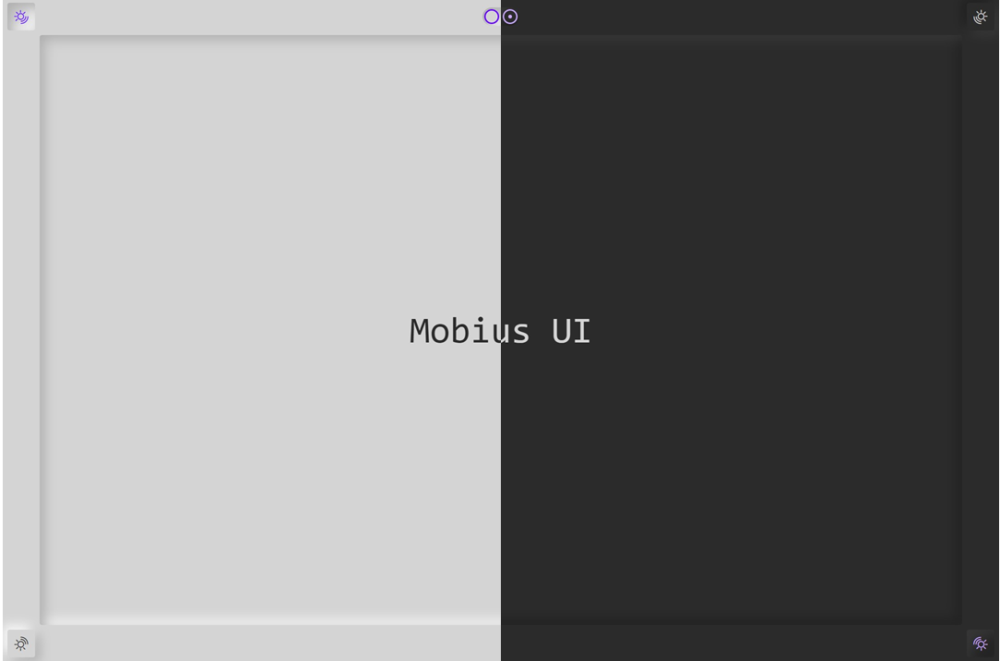

<p align="center">
  <a href="#" target="_blank" rel="noopener noreferrer">
    
  </a>
</p>

<p align="center">
  <a href="https://standardjs.com"></a>
  <a href="http://commitizen.github.io/cz-cli/"></a>
  <a href="https://www.jsdelivr.com/package/gh/we-mobius/mobius-ui"></a>
</p>

<p align="center">
  <span style="font-weight: bold; color: hsla(96, 100%, 50%, 100%);">📜 English Doc</span>
  &nbsp;|&nbsp;
  <a href="./docs/readme_zh.md" style="color: hsla(264, 100%, 50%, 100%);">📜 中文文档</a>
</p>

<h1 align="center">Mobius UI - alpha</h1>

🎨 Mobius UI is a uitility-frist UI framework which inspired by Michal Malewicz's work on [Neumorphism](https://uxdesign.cc/neumorphism-in-user-interfaces-b47cef3bf3a6).

This repo will shows latest stage of Mobius UI before I surely complete the first stable version. We are now on the **alpha** stage.

The `alpha` stage means that most (over 70%) of the major features have been developed, and while there are still some uncertainties, there are already far fewer than the `preview` stage.

The main tasks in alpha stage are refining the base examples, developing complex components and writing documentation.

> 💬 Check todos & roadmaps for more information.

For a quickest preview: visit [Mobius UI preview](https://mobius-ui.21yunbox.com/).

## Details



## Instance

<div style="display: flex; justify-content: space-between; align-items: center;">
  <div style="margin: 0.5em auto; width: 30%; display: flex; flex-flow: column wrap; align-items: center;">
    <a href="#Instance" target="_blank">
      
    </a>
    <p>Avatar Center</p>
  </div>
  <div style="margin: 0.5em auto; width: 30%; display: flex; flex-flow: column wrap; align-items: center;">
    <a href="#Instance" target="_blank">
      
    </a>
    <p>Empty Seat...</p>
  </div>
  <div style="margin: 0.5em auto; width: 30%; display: flex; flex-flow: column wrap; align-items: center;">
    <a href="#Instance" target="_blank">
      
    </a>
    <p>Empty Seat...</p>
  </div>
</div>

## Documentation

Minimum Use Example:

```html
<!DOCTYPE html>
<html lang="en">
<head>
  <meta charset="UTF-8">
  <meta name="viewport" content="width=device-width, initial-scale=1.0">
  <title>Mobius CSS</title>
  <link rel="stylesheet" href="style.css">
</head>
<body>

</body>
</html>
```

Since it's just a **pure CSS library**, you can use it in your own projects with confidence.

However, for insurance purposes, before making sure that you and your team are fully familiar with the 'utility-first' way of CSS organization, it is still recommended that first use it in toy projects.

Here are some tips for you:

- 💻 Read **Design Spec.** and check source code of **Preview Site** to know how to use. ~~In the short term, there won't be a User Guide to show you how to use it exactly.~~ Instructions & Documentation are on the way...
- 💡 For developers who prefer local build to `<link>` tag import, it is recommended to enable server compression in production. Due to the large number of verbose variables, use `gzip` will reduce it from ~110 KB to less than 15 KB (84% compressed, `brotli` done better). ~~Later I will build a public CDN with Gzip opened, you can use it with a simple `<link>` tag in your pages instead of local build.~~ jsDelivr is awesome, just use it.
- ⭐ Star & Watch to follow the latest work I've done. If you have any questions or suggestions, feel free to open an ISSUE (Or you can add my wechat for join our initial community) 🤗

All the relative documentations of detail, pls check `./docs`，which contains:

- [Getting Started](./docs/getting_started.md) - How to Build & How to Use
- [Instructions](./docs/instructions.md) - Instructions
- [Design Specification](./docs/design_specification.md) - Design Specification
- [Todos](./docs/todos.md) - Todos & Roadmaps

## Built With

Priview Site is build with:

- [cyclejs](https://github.com/cyclejs/cyclejs) - Great Jobs for handle DOMs functionally and reactively 🤞
- [rxjs](https://github.com/ReactiveX/rxjs) - Reactive programming library for JavaScript
- [tailwindcss](https://github.com/tailwindcss/tailwindcss) - Utility-first CSS framework
- [21yunbox](https://www.21yunbox.com/) - Static pages host service provider

## Author

- **Cigaret** - *Undergraduate of CUC*
  - E-mail: kcigaret@outlook.com
  - wechat: cigaret_bot

## License

This project is licensed under the **GPL-3.0** License - see the [LICENSE](LICENSE) file for details.
