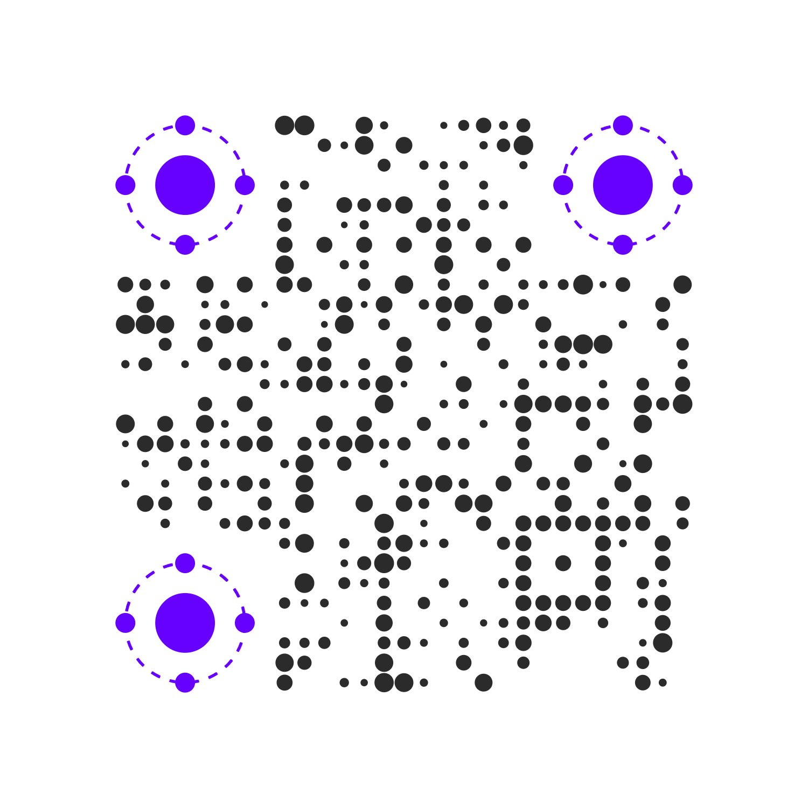

<p align="center">
  <a href="#" target="_blank" rel="noopener noreferrer">
    
  </a>
</p>

<p align="center">
  <a href="https://standardjs.com"></a>
  <a href="http://commitizen.github.io/cz-cli/"></a>
  <a href="https://www.jsdelivr.com/package/gh/we-mobius/mobius-ui"></a>
</p>

<p align="center">
  <a href="../README.md" style="color: hsla(264, 100%, 50%, 100%);">📜 English Doc</a>
  &nbsp;|&nbsp;
  <span style="font-weight: bold; color: hsla(96, 100%, 50%, 100%);">📜 中文文档</span>
</p>

<h1 align="center">Mobius UI - alpha</h1>

🎨 Mobius UI 是一个类 Neumorphism （新拟态）风格的 UI 框架，它的核心是「一套设计风格应用指南」 + 「一种 UI 层面的代码组织方式」。

在项目完全成型之前，以上介绍可能会略显含糊，不过没有关系，Mobius CSS 是其中的一部分，你可以直接使用它来在页面中应用 Neumorphism （新拟态）风格。

> 关于 Neumorphism 风格相关的信息，请查阅：[Neumorphism](https://uxdesign.cc/neumorphism-in-user-interfaces-b47cef3bf3a6) - Michal Malewicz。

目前，Mobius UI 处于 Alpha 阶段，七成以上的主要样式开发工作都已经完成，虽然在样式类命名、模块分割等方面还存在不确定性，但与 preview 阶段相比已经好太多太多了。这一阶段预计历时 6 个月左右，主要的任务是**完善基础示例**、**开发复杂组件**以及**撰写风格应用指南和使用文档**，你随时可以查看 `docs` 目录下的 `todos` 文件获知最新最近的任务安排和进展。

Mobius UI 应用示例快速预览，请访问：[Mobius UI preview](https://mobius-ui.21yunbox.com/).

## 预览


## 实例

<table>
  <tbody>
    <tr>
      <td align="center" valign="middle">
        <a href="#Instance" target="_blank">
          
        </a>
        <p style="width: 100%; text-align: center;">头像中心小程序</p>
      </td>
      <td align="center" valign="middle">
        <a href="#Instance" target="_blank">
          
        </a>
        <p style="width: 100%; text-align: center;">Preview Site</p>
      </td>
      <td align="center" valign="middle">
        <a href="#Instance" target="_blank">
          
        </a>
        <p style="width: 100%; text-align: center;">虚位以待...</p>
      </td>
    </tr>
  </tbody>
</table>

## 文档

简单使用示例，查看效果请访问：🔗 [Simple Use Example](https://mobius-ui-example.21yunbox.com/example.html)

```html
<!DOCTYPE html>
<html lang="en">

<head>
  <meta charset="UTF-8">
  <meta name="viewport" content="width=device-width, initial-scale=1.0">
  <title>Mobius CSS</title>
  <link rel="stylesheet" href="https://cdn.jsdelivr.net/npm/@we-mobius/mobius-ui@0.1.0/release/styles/mobius.css">
</head>

<body>
  <div class="mobius-width--100vw mobius-height--100vh mobius-layout__vertical">
    <div class="mobius-padding--xl mobius-margin--auto mobius-shadow--normal mobius-rounded--base">
      <div class="mobius-layout__vertical mobius-flex-items--center mobius-select--none">
        
        <p class="mobius-text--center mobius-text--xl mobius-font--fantasy">
          <span class="mobius-text--3xl">Hi</span>, developers !
        </p>
        <p>
          Scan to meet full features of Mobius UI.
        </p>
      </div>
    </div>
  </div>
</body>

</html>
```

Mobius CSS 是一个纯 CSS 的样式库，当前阶段你完全可以放心地将它应用在自己的项目中! 需要注意的是，如果你或者你的团队对 Utility-first 的 CSS 组织方式并不是很熟悉的话，建议你们先在业余项目中引进，待熟悉之后再对是否引入正式项目做理性的权衡。

以下是一些使用建议：

- 💻 文档和指南将会陆续上线，在此之前，你可以通过阅读 Preview Site 的源码来了解如何使用，也可以加入社区进行咨询；
- 💡 对于更喜欢使用本地构建版本的开发者来说，推荐在生产环境中开启服务端压缩以减小文件体积。当前最新版本的 `mobius.css` 将近 110 KB，在启用 Gzip 的情况下可以缩小至 15 KB 不到（压缩比高达 84%），如果是 Brotli 的话表现应该会更好。
- ⭐ 如果在使用中遇到任何问题或者在功能上有任何建议，可以随时发起 ISSUE，或者加入我们的初始社区寻求帮助或发起讨论（联系方式见文末）。

更加详细的文档，请查阅 `./docs`，其中包括:

- [上手使用](./docs/getting_started.md) - 如何构建 & 如何使用
- [使用说明](./docs/instructions.md) - 使用说明
- [设计原则](./docs/design_specification.md) - 设计原则
- [待办](./docs/todos.md) - 待办 & 迭代路线

## 技术栈

- [cyclejs](https://github.com/cyclejs/cyclejs) - Mobius UI 项目相关的站点由 cyclejs 驱动 🤞
- [rxjs](https://github.com/ReactiveX/rxjs) - 响应式的 JavaScript 工具库
- [tailwindcss](https://github.com/tailwindcss/tailwindcss) - 样式类优先的 CSS 样式框架，Mobius CSS 在实现的过程中多有借鉴 Tailwind CSS 的样式类切割方案
- [21 云盒子](https://www.21yunbox.com/) - 本项目展示页面使用 21 云盒子提供的静态页面部署服务
- [QRBTF](https://qrbtf.com/) - 参数化二维码生成器

## 作者

- **Cigaret**
  - E-mail: kcigaret@outlook.com
  - wechat: cigaret_bot（添加请备注 Mobius UI）

## 开源许可

此项目依据 **GPL-3.0** 开源许可开源 - 许可详情请查阅 [LICENSE](LICENSE)。
